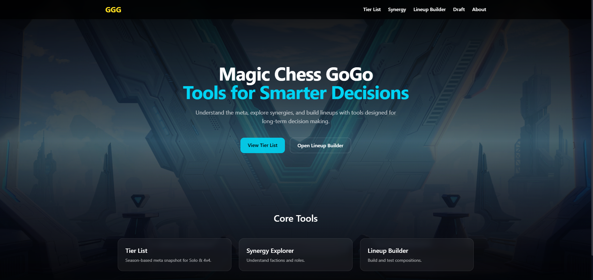
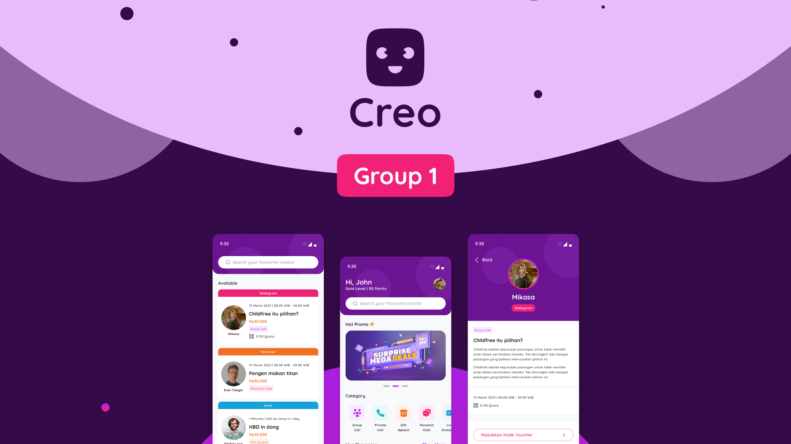

## Hi there 👋 I'm Putu
Web developer building game guides, tools, and data-driven experiences.

I'm a **web developer focused on game-related projects**, such as **guides, tools, and data-driven websites**.

I'm a game enthusiast at heart, with growing interests in **data and backend systems**, while actively learning and improving my **frontend skills**.

---

### 🎮 Focus
- Game guide websites & companion tools
- Data-driven content for games

---

### 🛠 Tech Stack
**Main**
- ⚛️ React
- 🐍 Python

**Secondary**
- ☕ Java
- 📱 Kotlin
  

**Learning / Exploring**
- Frontend best practices & UI architecture
- Backend fundamentals & data processing

---

### 🚀 Featured Projects

**Magic Chess GoGo (MCGG)**  
A visual, beginner-friendly guide platform for Magic Chess.  
🔗 https://mcgg-khoceng.vercel.app/

**Creo Project**  
An application that connects content creators with their audience.

---

### 🌱 Currently
- Improving frontend fundamentals
- Learning backend & data concepts

---

### 📫 Connect
Feel free to explore my repositories or reach out for collaboration.
